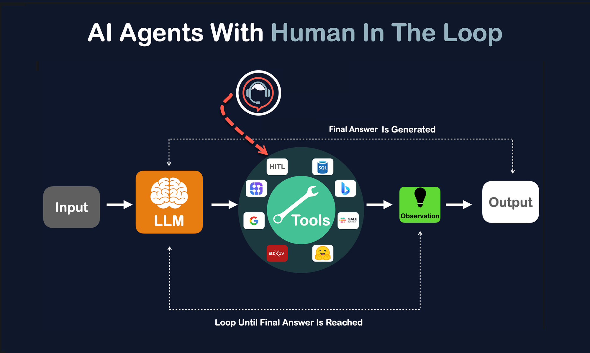
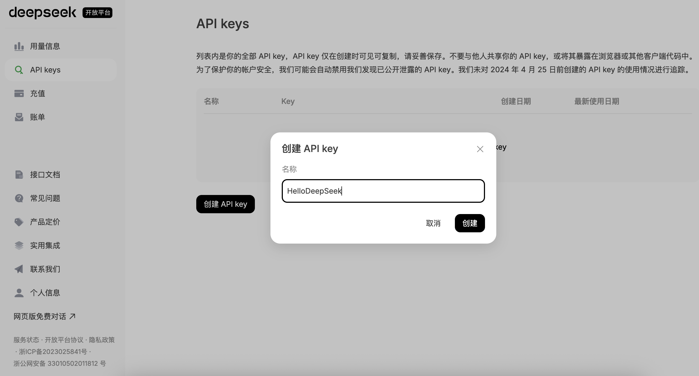
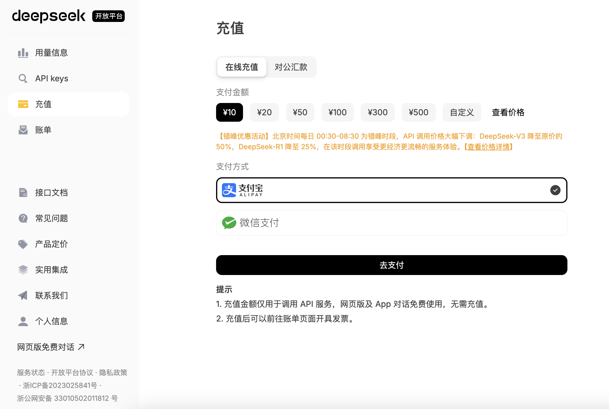

## AI智能体开发入门

> **引言**：人工智能正在以前所未有的速度重塑我们的生活。从写作助手到智能客服，从推荐算法到自动驾驶，无不体现着“智能体”的力量。那么，什么是 AI 智能体，目前的业务是否适合 AI 智能体，如何打造一个属于自己的 AI 智能体，希望这个系列的文章能够帮助大家找到答案。

### AI智能体是什么

简单来说，**AI 智能体（AI Agent）**是一类能够感知环境、做出决策并执行任务的智能程序。在过去，我们更多使用的是“工具型 AI”，例如语音识别、翻译、图像识别等。智能体的出现，让 AI 具备了**目标感**与**自主性**。

AI智能体的典型特征包括：

- **感知能力**：能接收来自环境或用户的多模态输入（文本、图像、语音等）。
- **推理与决策**：能够利用大语言模型（LLM）、知识库、规则系统以及历史记忆，对当前任务进行理解、分析和规划，生成合理的行动策略。
- **任务执行**：能够调用外部工具（如搜索引擎、数据库、API 等），执行具体操作并完成目标任务。
- **状态管理与反馈学习**：能够管理对话上下文、维护长期记忆，并通过反馈机制不断优化自身行为。

事实上，日常工作中有很多重复、繁琐、乏味的劳动都是可以通过 AI 智能体完成的，尤其是问题需要处理大量**非结构化数据**（文本、语音、代码等）、涉及**自然语言理解与生成**、需要**跨领域知识整合**、需要高效的信息检索和摘要时，AI 智能体将会是非常好的选择。目前，有很多公司已经启动了“一个业务人员 + 多个 AI 智能体”协同办公的模式，业务人员不再执着于那些重复、繁琐、乏味的劳动，而是扮演**任务发起者**、**结果审核者**、**策略调用者**这样的角色，**专注于目标和决策**，而**多个智能体负责任务的拆解、执行、分析和反馈**，如下图所示。



此外，通过对飞书、钉钉等企业协作工具的接入，AI 智能体可以通过 IM 对话触发任务并通过调用 API 接口回写结果，如此每个人的工作效率都会得到极大的提升。我们可以大胆的预测，这样的工作方式将逐渐成为很多企业的常态。当然，AI 智能体也不是万能的，当需要处理的任务需要严格的确定性和可验证性，涉及到强安全性或隐私问题的时候，仍然需要人工审核和关键节点确认或者使用一些传统的解决方案。下面的表格对一些典型的业务场景是否适合使用智能体进行了简单总结，供大家参考。

| 业务场景         | 是否适合 | 说明                                              |
| ---------------- | -------- | ------------------------------------------------- |
| **智能客服**     | ✅        | 处理多轮对话、理解用户意图，提高自动化水平        |
| **法律文书生成** | ✅        | 可以利用 LLM 进行合同起草、合规审核，但需人工校对 |
| **金融数据分析** | ❌        | 需要高精度计算，传统 BI / SQL 更适合              |
| **用户评论分析** | ✅        | 适合 LLM 进行情感分析、关键词提取                 |
| **AI 编码助手**  | ✅        | 可以加速开发，但仍需人工代码审查                  |
| **精确报销计算** | ❌        | 需要高确定性，规则引擎更合适                      |

在过去，构建一个具备“智能”的系统意味着繁杂的机器学习工程、大量的数据标注与训练、精细的规则系统编写；而现在，得益于大模型（如GPT-4、Claude、Gemini、DeepSeek等）的能力暴涨，我们可以用几十行 Python 代码就构建一个“足够聪明”的 AI 智能体。与此同时，开源框架如 [LangChain](https://www.langchain.com/)、[Transformers](https://huggingface.co/transformers/)、[LlamaIndex](https://www.llamaindex.ai/) 等也大大降低了构建智能体的门槛。对于 Python 语言不熟悉的小伙伴，可以移步到我的知乎专栏[“从零开始学Python”](https://www.zhihu.com/column/c_1216656665569013760)。当然，我们也可以利用像 Coze（扣子）、Dify 这样的工具实现零代码构建 AI 智能体，这类工具对于不熟悉编程的人群更加友好，但是如果要构建复杂的工作流，一些关键节点仍然需要通过代码来实现，所以建议大家提前储备一些 Python 语言的知识，这项技能会让你在构建智能体时更加得心应手。

> **说明1**：Coze 是字节跳动推出的一站式 AI Agent 搭建平台，核心目标是**让非程序员也能快速构建可用的智能体应用**。Coze 通过可视化配置的方式，支持用户创建对话式 Agent，并为其配置**大模型**、**提示词**、**插件**、**知识库**和**工作流**。平台内置了丰富的插件生态，可直接对接搜索、网页、API 等能力，同时天然支持接入**飞书**、**抖音**等字节生态产品，适合企业内部应用和业务自动化场景。

> **说明2**：Dify 是一个开源的 LLM 应用与 Agent 开发平台，定位偏向**开发者**和**技术团队**。Dify 提供完整的模型接入、Prompt 管理、RAG（检索增强生成）、工作流编排和 API 服务能力，支持多种主流大模型。由于支持私有化部署和深度定制，Dify 常被用于企业级 AI 应用开发、SaaS 产品集成以及复杂业务系统的智能化改造。

### 通过API接入大模型

考虑到国内用户访问和调用 OpenAI 会存在诸多麻烦，下面我们以接入 DeepSeek 为例，先为大家讲解如何通过 Python 程序访问 DeepSeek 的 API 接口，完成跟大模型的第一次对话。当然，我们也可以使用 Kimi、Qwen 等大模型，在很多任务中它们都可以作为 GPT 的替代。

首先，我们需要在 DeepSeek [开放平台](https://platform.deepseek.com/)创建一个访问接口的 API Key，如下图所示。创建 API Key 的时候需要给它设置一个名称（随意就好），然后记得把生成的 API Key 复制下来。



当然，调用 API 接口服务是需要充值的，平常我们使用网页版及 App 对话是免费的。建议大家先充 10 元体验一下。后续根据具体的需求再决定是否要使用 DeepSeek 提供的接口，如下图所示。



上面两个步骤完成以后，我们就可以使用 Python 代码接入 DeepSeek 了。如果你有使用 Python 程序调用 API 接口的经验，那么下面的操作对你来说是再熟悉不过了。

```python
import json

import requests

# API接口的地址
url = 'https://api.deepseek.com/chat/completions'
# 构造HTTP请求头
headers = {
    'Content-Type': 'application/json',
    'Accept': 'application/json',
    'Authorization': 'Bearer <将你申请的API Key填写到此处>'
}
# 构造HTTP请求消息体
data = {
    # 模型的名称
    'model': 'deepseek-v4-flash',
    # 最大token数量
    'max_tokens': 512,
    # 温度参数
    'temperature': 0.8,
    # 频率惩罚参数
    'frequency_penalty': 1,
  	# 关闭思考模式
    'extra_body': {'thinking': {'type': 'disabled'}},
    # 是否开启流模式
    'stream': False,
    # 提示词（包含系统提示词和用户提示词）
    'messages': [
        {
            'role': 'system',
            'content': '你是一个创作宣传文案的助手，擅长用优雅的文笔撰写文案'
        },
        {
            'role': 'user',
            'content': '编写一段介绍Python-100-Days作者骆昊的文案，字数在500字左右'
        }
    ]
}
# 向API接口发起POST请求
resp = requests.post(
    url=url,
    headers=headers,
    data=json.dumps(data)
)
if resp.status_code == 200:
    # 解析JSON数据获取API接口响应内容
    print(resp.json()['choices'][0]['message']['content'])
else:
    print(resp.status_code)
```

> **提示**：上面的代码需要先装三方库`requests`，如果尚未安装，可以使用`pip install requests`进行安装。对于请求数据中的参数如果不理解可以先放放，后面我们会专门解释这些参数的含义。另外，API 接口的计费规则大家可以参考 DeepSeek 的[产品定价](https://api-docs.deepseek.com/zh-cn/quick_start/pricing/)页面，后面我们也会详细讲解如何计算 token 数以及如何控制对话窗口大小。

如果你觉得上面的代码过于繁琐，我们也可以调用 OpenAI 的 SDK 来改写上面的代码，很多大模型的 API 接口跟 OpenAI 都是兼容的，DeepSeek 也不例外。如果你使用 pip 作为包管理工具，我们可以通过下面的命令来安装名为 `openai` 的库。

```bash
pip install openai
```

下面，我们直接创建 `OpenAI` 对象来访问大模型，改写后的代码如下所示。

```python
from openai import OpenAI

client = OpenAI(
    api_key='<将你申请的API Key填写到此处>',
    base_url='https://api.deepseek.com'
)
resp = client.chat.completions.create(
    model='deepseek-v4-flash',
    max_tokens=512,
    temperature=0.8,
    frequency_penalty=1,
    extra_body={'thinking': {'type': 'disabled'}},
    messages=[
        {'role': 'system', 'content': '你是一个创作宣传文案的助手，擅长用优雅的文笔撰写文案'},
        {'role': 'user', 'content': '编写一段介绍Python-100-Days作者骆昊的文案，字数在500字左右'}
    ],
    stream=False,
)
print(resp.choices[0].message.content)
```

这里还有最后一个小问题，把 API Key 直接写在代码中肯定是不可取的，我们可以在系统的环境变量中配置名为 `OPENAI_API_KEY` 的环境变量，也可以在项目路径下放一个名为 `.env` 的文件，其内容如下所示。

```
OPENAI_API_KEY=sk-xxxxxxxxxxxxxxxxxxxxxxxxxxxxxxxx
```

> **注意**：`=` 的两边**没有空格**！！！

接下来，我们安装名为 `python-dotenv` 的三方库，它可以帮助我们从名为 `.env` 的文件中读取 `OPENAI_API_KEY` 的信息并放置到环境变量中，这样我们就不需要在代码中填写 API Key。如果你使用 pip 作为包管理工具，安装命令如下所示。

```bash
pip install python-dotenv
```

修改后的代码如下所示，我们使用 `load_dotenv` 函数从 `.env` 文件中加载 API Key。需要注意的是，如果你已经在用户或系统环境变量中配置了 `OPENAI_API_KEY`，那么在调用 `load_dotenv` 函数时，可以通过将参数 `override` 参数赋值为 `True` 来覆盖环境变量中的配置，也就是说，最终还是使用 `.env` 文件中配置的 `OPENAI_API_KEY`。

```python
from dotenv import load_dotenv
from openai import OpenAI

load_dotenv(override=True)

client = OpenAI(base_url='https://api.deepseek.com')
resp = client.chat.completions.create(
    model='deepseek-v4-flash',
    max_tokens=512,
    temperature=0.8,
    frequency_penalty=1,
    extra_body={'thinking': {'type': 'disabled'}},
    messages=[
        {'role': 'system', 'content': '你是一个创作宣传文案的助手，擅长用优雅的文笔撰写文案'},
        {'role': 'user', 'content': '编写一段介绍Python-100-Days作者骆昊的文案，字数在500字左右'}
    ],
    stream=False,
)
print(resp.choices[0].message.content)
```

### 总结

到此为止，我们已经完成了用 Python 程序跟大模型的第一次对话。我们构建 AI 智能体，一个核心的动作就是**利用大模型理解和生成自然语言的能力**，其中理解自然语言可以帮助我们捕获用户需求，而生成自然语言则是将问题的答案用人类自然语言输出。但是，**大模型没有记忆，不会阅读外部文档，不擅长做数学运算，也不懂得如何访问网络资源**，所以**需要我们用代码武装大模型**，让它变得更加强大，满足各类业务场景的需求，这就是 AI 智能体开发的核心。