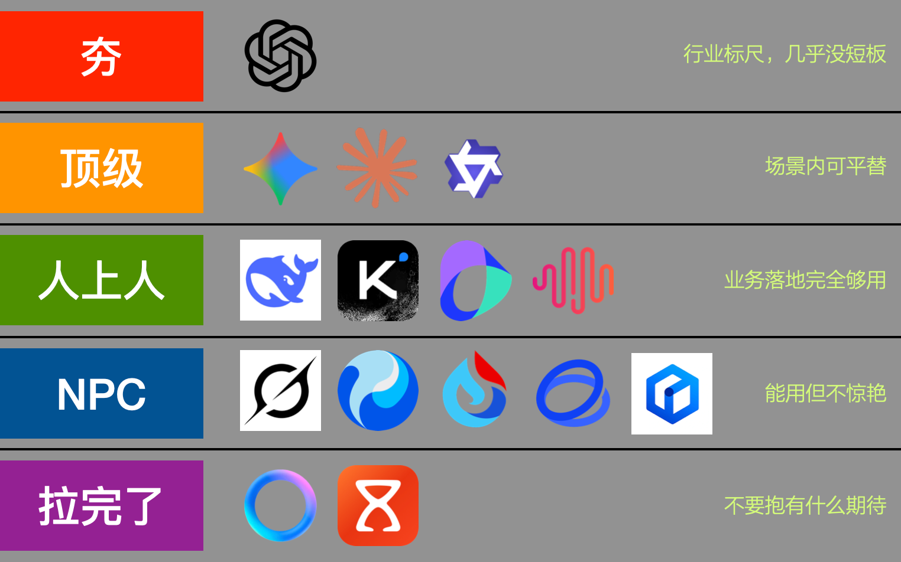
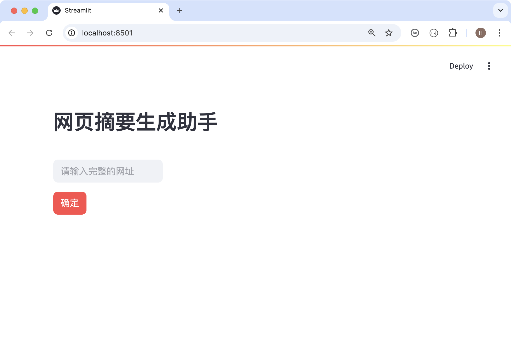
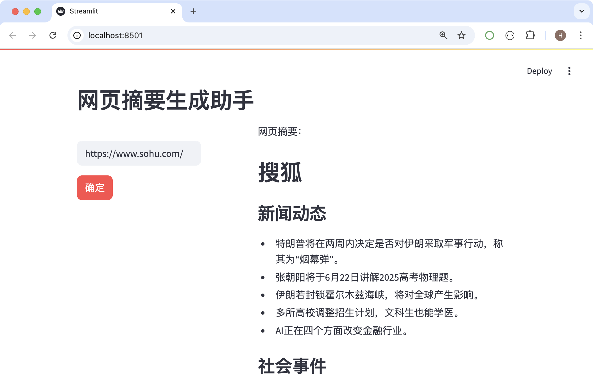
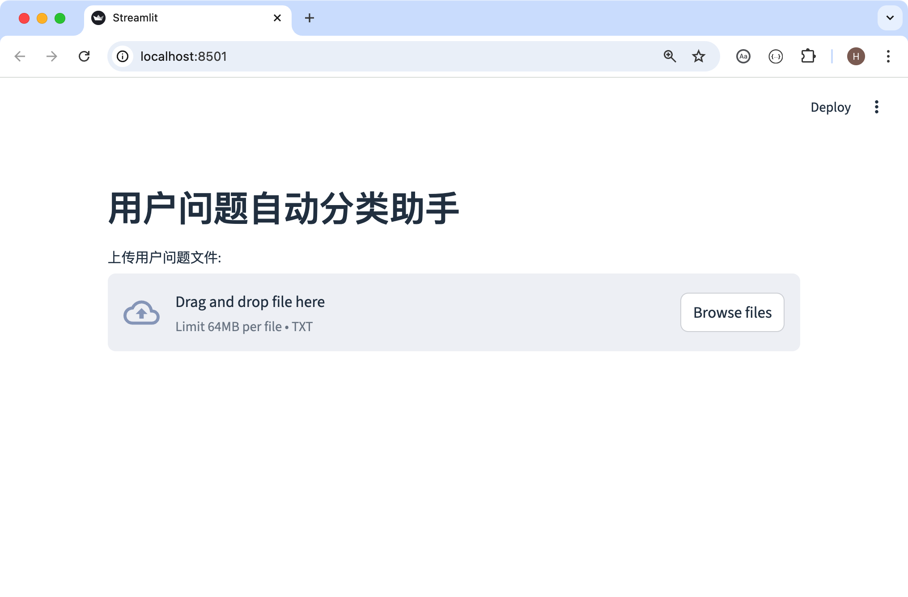
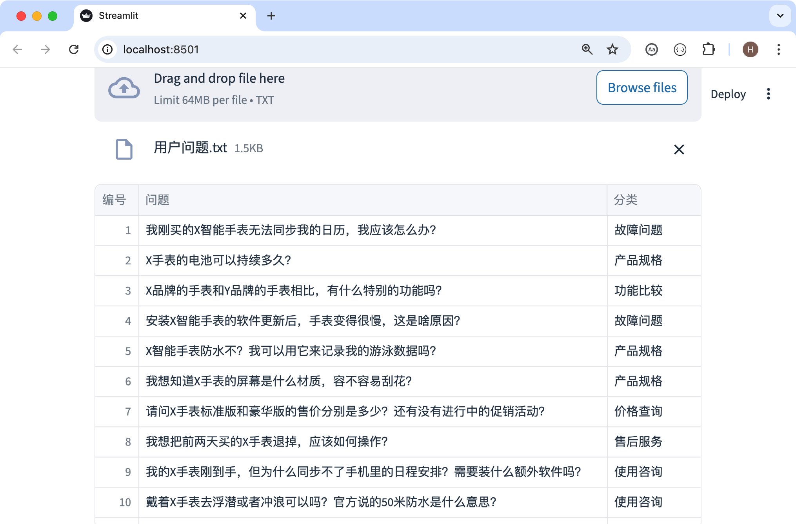

## 大模型能帮我们做什么

目前，不管你使用国内外哪家公司的大模型，就文本的理解和生成这两项能力而言，大家都有不错的表现。简单的说，如果你想利用大模型完成文本概况、信息提取、知识问答、文本分类、代码生成等任务并以此为基础构建 AI 智能体应用，绝大多数大模型都是可以胜任的。下面是我对国内外知名大模型从“夯”到“拉”的评价，个人观点，仅供参考。



下面，我们通过文本概括和文本分类两个案例，为大家展示大模型到底能帮我们做什么。

### 文本概括

文本概括是自然语言生成中的基本任务，将文章或概念概括成简洁易读的摘要也是大模型最为擅长的工作，而且这一任务在诸多领域都有应用场景。下面，我们来打造一个最为简单的 AI 智能体——网页摘要生成助手，用户输入网址，大模型为我们生成页面的摘要。首先，我们需要做一些准备工作，封装一个用于抓取网页标题和正文内容的函数，代码如下所示。

```python
import bs4
import requests


def fetch_page(url: str) -> tuple[str, str]:
    """
    抓取页面
    :param url: 统一资源定位符
    :return: 网页标题和主体内容构成的二元组
    """
    resp = requests.get(
        url=url,
        headers={
            'user-agent': 'Mozilla/5.0 (Macintosh; Intel Mac OS X 10_15_7) AppleWebKit/537.36 (KHTML, like Gecko) Chrome/137.0.0.0 Safari/537.36'
        },
    )
    if resp.status_code == 200:
        soup = bs4.BeautifulSoup(resp.text, 'html.parser')
        # 移除body标签下不包含文本内容的标签
        for elem in soup.body(['script', 'link', 'nav', 'header', 'footer', 'form', 'input', 'button',
                               'img', 'audio', 'video', 'area', 'canvas', 'map', 'object', 'embed']):
            elem.decompose()
        # 获取网页标题和主体内容返回二元组
        return soup.title.text, soup.body.get_text(separator='\n', strip=True)
    return '', ''
```

> **提示**：上面代码用到了 requests 和 beautifulsoup4 两个三方库做网络数据抓取和解析，不熟悉这两个库的小伙伴可以移步到[《从零开始学Python - 第035课：用Python解析HTML页面》](https://zhuanlan.zhihu.com/p/405207831)。

接下来，我们将前面通过 API 跟大模型对话的代码也封装成一个函数，这样做的好处是将一些常用的大模型参数设定做成函数参数的默认值，减少不必要的参数传递。

```python
def get_llm_response(client,
                     *, 
                     system_prompt='',
                     user_prompt='',
                     model='deepseek-v4-flash',
                     temperature=0.2,
                     frequency_penalty=0,
                     max_tokens=1024,
                     thinking=False,
                     stream=False):
    """
    获取大模型响应
    :param client: OpenAI对象
    :param system_prompt: 系统提示词
    :param user_prompt: 用户提示词
    :param model: 模型名称
    :param temperature: 温度参数
    :param frequency_penalty: 频率惩罚参数
    :param max_tokens: 最大token数量
    :param thinking: 是否开启思考模式
    :param stream: 是否开启流模型
    :return: 大模型的响应内容或Stream对象
    """
    messages = []

    if system_prompt:
        messages.append({'role': 'system', 'content': system_prompt})
    if user_prompt:
        messages.append({'role': 'user', 'content': user_prompt})
        
    config = {
        'model': model,
        'temperature': temperature,
        'frequency_penalty': frequency_penalty,
        'max_tokens': max_tokens,
        'messages': messages,
        'stream': stream,
    }
    if not thinking:
        config['extra_body'] = {'thinking': {'type': 'disabled'}}

    resp = client.chat.completions.create(**config)
    if not stream:
        return resp.choices[0].message.content
    return resp
```

> **提示**：注意上面的返回值，如果`stream`参数取值为`False`，那么函数直接返回大模型响应的内容；如果`stream`参数取值为`True`，函数返回的是一个`Stream`对象，你可以将该对象理解成迭代器，可以分段获取大模型响应的内容，稍后为大家演示。

接下来，我们使用 Streamlit 库来打造一个简单的用户界面。Streamlit 是一个开源的 Python 库，用于快速构建和分享数据应用，它特别适合数据科学家和机器学习工程师，因为你可以用简单的 Python 代码创建交互式应用，而无需复杂的前端开发。当然， 如果需要使用 Streamlit 构建用户界面，需要先在环境中执行安装 Streamlit 库，例如：`pip install streamlit`。

```python
import streamlit as st

result = ''

st.write('## 网页摘要生成助手')
col1, _, col2 = st.columns([3, 1, 4])

with col1:
    url_input = st.text_input(label=' ', placeholder='请输入完整的网址')
    button = st.button(label='确定', type='primary')

with col2:
    if result:
        st.write('网页摘要：')
        st.markdown(result)
```

假如上面的代码保存在名为`main.py`的文件中，通过在终端中执行下面的命令，我们可以看到浏览器中呈现的运行效果。

```bash
streamlit run main.py
```



接下来，就是把用户界面和调用大模型的代码结合起来，完成应用程序的开发。假设前面两个函数`fetch_page`和`get_llm_response`在名为`common.py`的文件中，下面的代码在名为`main.py`的文件中。这里我们得先设计好提示词，让大模型根据我们提供的网页标题和主体内容来生成摘要，并且让大模型返回 markdown 格式的摘要，以便于我们在网页中呈现出更好的效果。

````python
import streamlit as st
from dotenv import load_dotenv
from openai import OpenAI

from common import fetch_page, get_llm_response

user_prompt_template = '''
你是一个根据网页标题和内容生成摘要的优秀助手，请你根据我提供的标题和内容生成markdown格式的网页摘要。
注意：摘要中不要包含```markdown和```标签，将内容控制在1000个字符以内，尽可能用列表的形式呈现内容。

### 输出格式 ###
```markdown
## <标题>

### <第一部分>
- <内容1>
- <内容2>
- <内容3>

### <第二部分>
- <内容1>
- <内容2>
- <内容3>

### ...

### 总结
<总结内容>
```

### 网页标题和内容如下所示 ###
网页标题：{0}
主体内容：{1}
'''


def generate_summary(url):
    """生成网页摘要"""
    client = OpenAI(base_url='https://api.deepseek.com/')
    web_title, web_body = fetch_page(url)
    # 格式化提示词模板传入网页标题和内容生成完整的提示词
    user_prompt = user_prompt_template.format(web_title, web_body)
    # 传入OpenAI对象和提示词调用大模型获得响应内容
    return get_llm_response(client, user_prompt=user_prompt)


# 从.env配置文件中加载OPENAI_API_KEY到环境变量
# 这样就不需要在创建OpenAI对象时传入api_key参数
load_dotenv()

st.write('## 网页摘要生成助手')
col1, _, col2 = st.columns([2, 1, 4])
result = ''

with col1:
    url_input = st.text_input(label=' ', placeholder='请输入完整的网址')
    button = st.button(label='确定', type='primary')
    if button and url_input.strip():
        result = generate_summary(url_input)
with col2:
    st.write('网页摘要：')
    if result:
        st.markdown(result)
````

在终端中执行命令`streamlit run main.py`，上面代码的运行效果如下图所示。



大家将上面的代码顺利的运转起来后应该会注意到，大模型会直接返回完整的网页摘要，而在这个过程中，我们需要等待比较长的时间，如果我们能够启用“流模式”，一段段的获取大模型给我们的响应，那么用户体验将会得到很大的改善。修改后的代码如下所示，大家可以关注下哪些地方做了调整以及调整后的运行效果。

````python
import streamlit as st
from dotenv import load_dotenv
from openai import OpenAI

from common import fetch_page, get_llm_response

user_prompt_template = '''
你是一个根据网页标题和内容生成摘要的优秀助手，请你根据我提供的标题和内容生成markdown格式的网页摘要。
注意：摘要中不要包含```markdown和```标签，将内容控制在1000个字符以内，尽可能用列表的形式呈现内容。

### 输出格式 ###
```markdown
## <标题>

### <第一部分>
- <内容1>
- <内容2>
- <内容3>

### <第二部分>
- <内容1>
- <内容2>
- <内容3>

### ...

### 总结
<总结内容>
```

### 网页标题和内容如下所示 ###
网页标题：{0}
主体内容：{1}
'''


def generate_summary(url):
    """生成网页摘要"""
    client = OpenAI(base_url='https://api.deepseek.com/')
    web_title, web_body = fetch_page(url)
    user_prompt = user_prompt_template.format(web_title, web_body)
    stream = get_llm_response(client, user_prompt=user_prompt, stream=True)
    for chunk in stream:
        yield chunk.choices[0].delta.content or ''


load_dotenv()
result = None

st.write('## 网页摘要生成助手')
col1, _, col2 = st.columns([3, 1, 6])

with col1:
    url_input = st.text_input(label=' ', placeholder='请输入完整的网址')
    button = st.button(label='确定', type='primary')
    if button and url_input.strip():
        result = generate_summary(url_input)
with col2:
    if result:
        st.write('网页摘要：')
        st.write_stream(result)
````

> **说明**：修改代码后无需在终端中重新执行`streamlit run main.py`命令，只需要点击页面右上角的 Rerun 菜单项，只需要点击页面右上角的 Rerun 菜单项，。

### 文本分类

由于大模型对人类自然语言的理解能力已经非常强悍了，我们可以通过大模型对文本语义的理解，把输入文本映射到预定义类别，实现文本自动分类。文本分类应用在客服工单系统（将用户消息自动分类为投诉、售后、咨询、对比等）、舆情与内容风控（将内容划分为正常、违规、灰色等）、企业知识管理（将企业内部文档自动分类管理）等领域，帮助我们构建具备实用价值的 AI 智能体，下面我们举一个简单的例子。

```python
import numpy as np
import pandas as pd
import streamlit as st
from dotenv import load_dotenv
from openai import OpenAI

from common import get_llm_response

load_dotenv()
client = OpenAI(base_url='https://api.deepseek.com/')

categories = ['产品规格', '使用咨询', '功能比较', '价格查询', '故障问题', '售后服务', '其他问题']
sys_prompt = f'帮我将用户提出的问题分类到以下类别之一，具体的类别包括：{"、".join(categories)}，只输出类别不要包含其他文字。'

st.write('## 用户问题自动分类助手')

file_obj = st.file_uploader(label='上传用户问题文件:', type='txt')

if file_obj:
    questions, answers = [], []
    for line in file_obj.readlines():
        question = line.decode('utf-8').strip()
        questions.append(question)
        answer = get_llm_response(client, system_prompt=sys_prompt, user_prompt=question)
        answers.append(answer)

    df = pd.DataFrame(
        data={
            '编号': np.arange(1, len(questions) + 1),
            '问题': questions,
            '分类': answers
        }
    ).set_index('编号')
    st.dataframe(df)
```

> **说明**：上面的代码仍然用到了 `common.py` 模块中的 `get_llm_response` 函数。

运行上面的代码，网页中有一个上传文件的控件，点击可以上传包含用户问题的文本文件。



例如，我们上传如下所示的文本文件。

```
我刚买的X智能手表无法同步我的日历，我应该怎么办？
X手表的电池可以持续多久？
X品牌的手表和Y品牌的手表相比，有什么特别的功能吗？
安装X智能手表的软件更新后，手表变得很慢，这是啥原因？
X智能手表防水不？我可以用它来记录我的游泳数据吗？
我想知道X手表的屏幕是什么材质，容不容易刮花？
请问X手表标准版和豪华版的售价分别是多少？还有没有进行中的促销活动？
我想把前两天买的X手表退掉，应该如何操作？
我的X手表刚到手，但为什么同步不了手机里的日程安排？需要装什么额外软件吗？
戴着X手表去浮潜或者冲浪可以吗？官方说的50米防水是什么意思？
能在X手表上离线存储音乐吗？跑步时不想带手机能连蓝牙耳机听吗？
更新了X手表的最新系统后，心率监测好像不太准了，重启也没用，怎么回事？
X手表的充电底座接触不良，有时候充不上电，是底座坏了还是手表问题？
用手表记录跑步路线，轨迹漂移很厉害，GPS定位这么差吗？怎么校准？
X手表的运动版和时尚版除了表带，功能上有区别吗？哪个更适合日常通勤？
X手表的表壳是金属还是塑料的？日常磕碰容易留下痕迹吗？
原装的X手表替换表带要多少钱？有没有第三方推荐的？
X手表的保修期是多长？屏幕摔碎了属于保修范围吗？维修大概多少钱？
```

执行结果如下图所示。



### 总结

在传统的 NLP（自然语言处理）任务方面，除了上面提到的文本概况、文本分类外，LLM 在信息抽取、知识问答、代码生成等方面也是有想当亮眼的表现。事实上，如今的大模型在内容设计、角色扮演和情景模拟、代码迁移与重构、数据分析与建模辅助、任务分解与执行规划、多模态任务和推理等领域也具备相当强悍的实力。后面，我们会陆续为大家介绍这些方面的应用以及智能体程序的开发。
