## 自己动手撸一个聊天机器人

在前面的章节中，我们已经学会了如何通过 API 与大模型对话，也体验过大模型在文本生成、文本分类等任务中的强大能力。本章我们带大家用前面学到的知识，自己动手从零开始构建一个可交互、可部署的聊天机器人应用。我们要做的事情包括：

1. 使用 Streamlit 构建一个对话式 AI 聊天界面。
2. 支持用户动态切换大模型服务商以及选择对应的模型。
3. 将代码部署到 Streamlit Cloud，让所有人都能访问。

### 效果预览和关键点

在开始写代码之前，我们先看看最终的运行效果，如图所示。

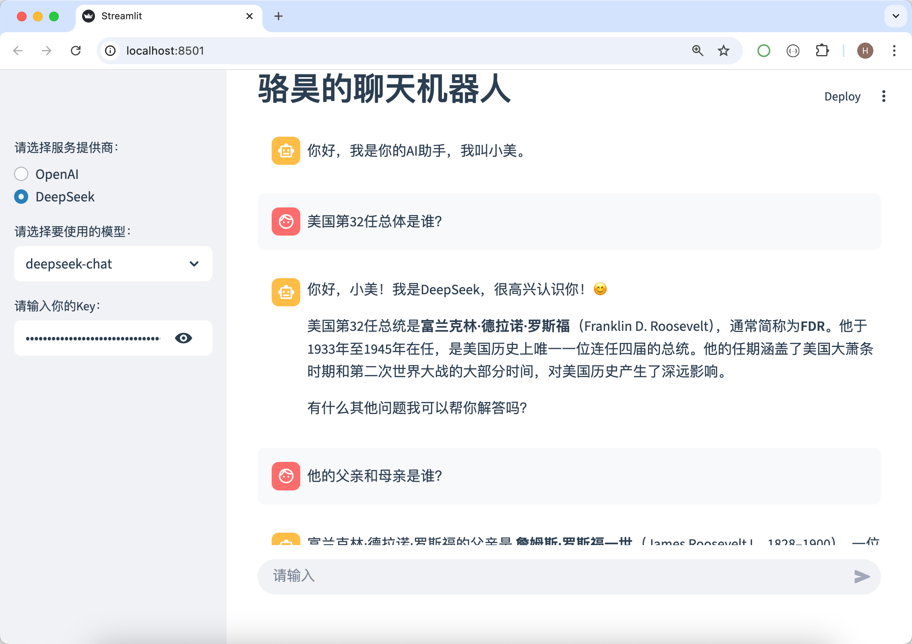

这个聊天机器人具备以下特性：

- 类似 ChatGPT 的对话界面  
- 支持 OpenAI / DeepSeek 等服务提供商  
- 支持流式输出，实时展示模型返回内容  
- 支持多轮对话，上下文自动延续  

完成这个项目并不困难，需要使用的知识前面基本都讲过了，有几个关键点提醒一下大家：

1. 对话状态管理（能够记住之前对话的内容）
2. 模型调用抽象（根据用户选择的服务创建客户端）
3. 流式输出处理（把流式响应反映在用户界面上）

### 核心代码解析

下面是聊天机器人的核心代码，我们分模块为大家进行讲解。

#### 从大模型获取流式响应

我们把从大模型获得用户提问对应的答案的代码封装成函数，请注意函数中`yield`关键字的使用，这是实现流式输出的关键，Streamlit 可以边接收、边渲染内容。

```python
def get_answer(question: str):
    """通过大模型获取用户问题的答案"""
    try:
        client = OpenAI(base_url=base_url, api_key=api_key)
        stream = get_llm_response(
            client,
            model_name=model_name,
            system_prompt='请根据【用户提问】部分直接做出回答，在缺少必要信息时才使用【历史记录】部分的内容',
            user_prompt=question,
            stream=True
        )
        for chunk in stream:
            yield chunk.choices[0].delta.content or ''
    except Exception:
        yield from '暂时无法提供回复，请检查你的配置是否正确'
```

> **注意**：上面的函数使用了我们之前封装的`get_llm_response`函数，如果没有印象了，请自行翻看上一个章节。

#### 多个服务商与模型切换

根据不同服务商，动态修改`base_url`的值和可用的模型列表，这样做模型是可插拔的，而不是写死的。这个功能我们把它做成了页面的侧边栏，可以方便的展开或折叠。

```python
import streamlit as st

with st.sidebar:
    api_vendor = st.radio(label='请选择服务提供商：', options=['Moonshot AI', 'DeepSeek'])
    if api_vendor == 'Kimi':
        base_url = 'https://api.moonshot.cn/v1'
        model_options = ['kimi-k3', 'kimi-k2.7-code', 'moonshot-v1-8k', 'moonshot-v1-32k']
    elif api_vendor == 'DeepSeek':
        base_url = 'https://api.deepseek.com'
        model_options = ['deepseek-v4-flash', 'deepseek-v4-pro']
    model_name = st.selectbox(label='请选择要使用的模型：', options=model_options)
    api_key = st.text_input(label='请输入你的Key：', type='password')
```

#### 对话状态管理

我们使用 Streamlit 提供的`session_state`来进行简单的对话状态管理，`session_state`可以理解成一个字典，你可以用键值对的方式保存数据。下面的代码中，我们用一个名为`messages`的键将所有对话保存在一个列表容器中，列表中的每个元素都是二元组，二元组的第一个元素用来区分是用户的提问还是 AI 的回复，第二个元素要用保存对应的内容。页面加载时，`session_state`中并没有名为`messages`的键，这个时候我们直接添加键值对，并将 AI 的问候语作为第一个对话的内容；当用户输入新的问题或者接收到大模型的答案时，我们可以通过`session_state['messages']`获得保存对话的列表，通过列表的`append`方法，我们可以新的对话加入其中。

```python
if 'messages' not in st.session_state:
    st.session_state['messages'] = [('ai', '你好，我是你的AI助手，我叫小美。')]
```

页面加载或刷新时，我们可以通过下面的 for 循环，展示对话的内容。我们使用了 Streamlit 提供的 `chat_message` 组件，它可以非常方便地构建出类似 ChatGPT 的对话效果

```python
for role, content in st.session_state['messages']:
    st.chat_message(role).write(content)
```

#### 处理用户输入和流式输出

接下来是整个代码中最“灵魂”的部分，用户输入问题立即展示到界面上，收到 AI 的回复进行流式输出，对话的内容写回到`session_state`的`messages`中，如下所示。

```python
user_input = st.chat_input(placeholder='请输入')
if user_input:
    history = ''
    if len(st.session_state['messages']) > 1:
        _, history = st.session_state['messages'][-1]
    st.chat_message('human').write(user_input)
    st.session_state['messages'].append(('human', user_input))
    with st.spinner('AI正在思考，请耐心等待……'):
        answer = get_answer(f'【历史记录】: {history}\n\n【用户提问】: {user_input}')
        result = st.chat_message('ai').write_stream(answer)
        st.session_state['messages'].append(('ai', result))
```

注意上面代码的第 4 行和第 5 行代码，这里我们获取了历史对话的最后一条内容；在代码的第 9 行，当我们接收到用户的提问调用`get_answer`函数的时候，我们把上一轮对话的内容加到了本轮问题的前面，作为用户提示词的一部分。之前，我们封装`get_answer`函数时，通过系统提示词告诉大模型，如果可以直接回答用户的提问就直接回答；如果缺少必要的信息才使用历史记录。代码第 10 行，我们使用了`chat_message`组件的`write_stream`方法，这样我们就可以直接将迭代器作为参数传入，将流式输出内容展示到用户界面上。

#### 完整的可运行代码

到这里，一个可用的聊天机器人已经基本完成了，虽然它还有很多问题，例如只能记住上一轮的对话信息、没有多模态能力、网页刷新时会重新开启对话等等，但它至少已经可以运转起来了。有兴趣的小伙伴可以一边继续学习一边完善它的功能，相信你会在收获知识的同时收获乐趣，完整的代码如下所示。

```python
import streamlit as st
from openai import OpenAI

from common import get_llm_response


def get_answer(question: str):
    """通过大模型获取用户问题的答案"""
    try:
        client = OpenAI(base_url=base_url, api_key=api_key)
        stream = get_llm_response(
            client,
            model_name=model_name,
            system_prompt='请根据【用户提问】部分做出回答，在缺少必要信息时才考虑【历史记录】',
            user_prompt=question,
            stream=True
        )
        for chunk in stream:
            yield chunk.choices[0].delta.content or ''
    except Exception:
        yield from '暂时无法提供回复，请检查你的配置是否正确'


with st.sidebar:
    api_vendor = st.radio(label='请选择服务提供商：', options=['OpenAI', 'DeepSeek'])
    if api_vendor == 'Kimi':
        base_url = 'https://api.moonshot.cn/v1'
        model_options = ['kimi-k3', 'kimi-k2.7-code', 'moonshot-v1-8k', 'moonshot-v1-32k']
    elif api_vendor == 'DeepSeek':
        base_url = 'https://api.deepseek.com'
        model_options = ['deepseek-v4-flash', 'deepseek-v4-pro']
    model_name = st.selectbox(label='请选择要使用的模型：', options=model_options)
    api_key = st.text_input(label='请输入你的Key：', type='password')

if 'messages' not in st.session_state:
    st.session_state['messages'] = [('ai', '你好，我是你的AI助手，我叫小美。')]

st.write('## 骆昊的聊天机器人')

if not api_key:
    st.error('请提供访问大模型需要的API Key！！！')
    st.stop()

for role, content in st.session_state['messages']:
    st.chat_message(role).write(content)

user_input = st.chat_input(placeholder='请输入')
if user_input:
    history = ''
    if len(st.session_state['messages']) > 1:
        _, history = st.session_state['messages'][-1]
    st.chat_message('human').write(user_input)
    st.session_state['messages'].append(('human', user_input))
    with st.spinner('AI正在思考，请耐心等待……'):
        answer = get_answer(f'【历史记录】: {history}\n\n【用户提问】: {user_input}')
        result = st.chat_message('ai').write_stream(answer)
        st.session_state['messages'].append(('ai', result))
```

> **说明**：之前封装的`get_llm_response`函数被我放在了名为`common.py`的文件中，因此上面的代码用`from common import get_llm_response`进行了导入，大家可以根据自己代码的状况进行调整。

### Streamlit 项目部署

我们可以把项目部署到云端，这样想使用的人就可以通过我们提供的网址进行访问。这里，我们直接使用 Streamlit Community Cloud 进行部署。首先，我们将项目同步到 GitHub（全球最大的代码托管平台），熟悉 Git 的小伙伴可以使用终端命令或者图形化的 Git 工具来完成，不熟悉 Git 的可以在浏览器中进行操作，步骤如下所示。

1. 登录 GitHub，创建一个新的仓库（Repository）。

   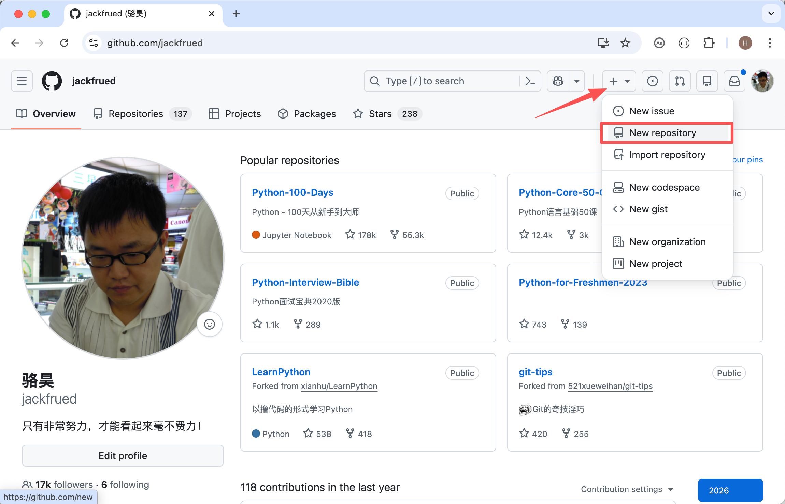

   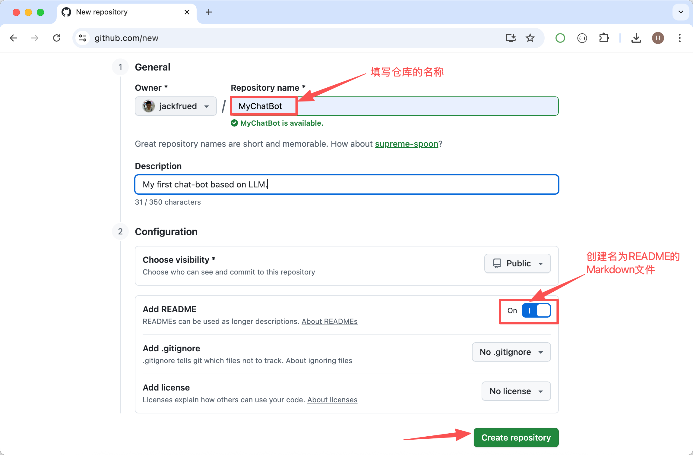

2. 将代码同步到仓库（可以使用 Git 版本控制工具或者直接在浏览器窗口上传）。除了项目所需代码之外，我们还需要提供一个名为`requirements.txt`的文件，这个文件是项目所需依赖项的清单，里面需要包含 streamlit 和 openai 两个三方库的名字，如下所示。

   ```
   streamlit
   openai
   ```

   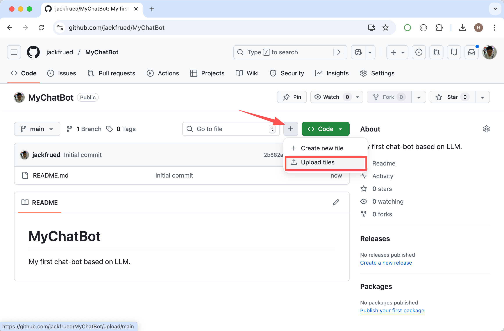

   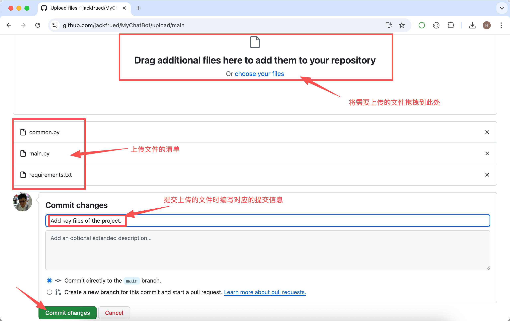

   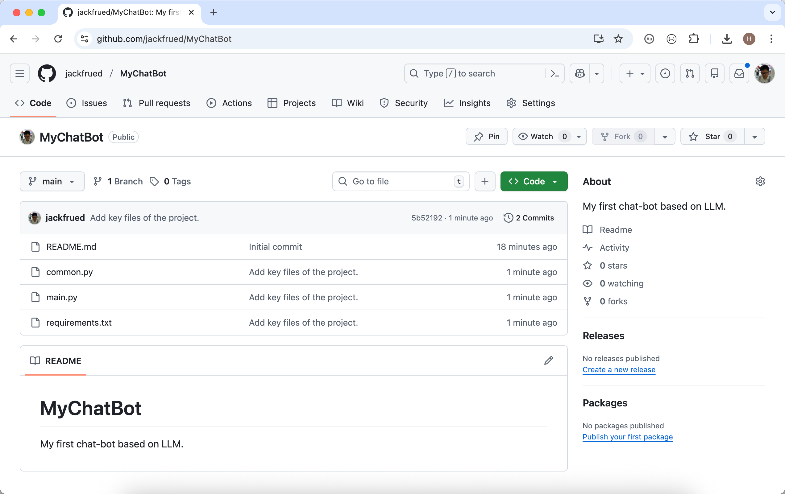

然后，我们直接用 GitHub 账号登录 Streamlit 平台，在如下图所示的画面中点击右上角的 Create app。

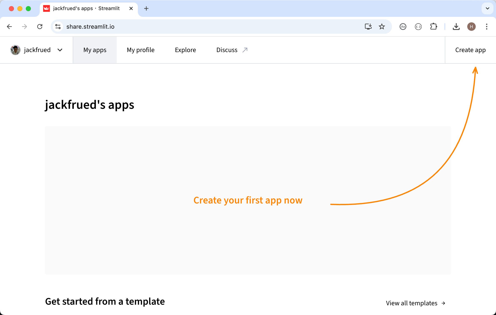

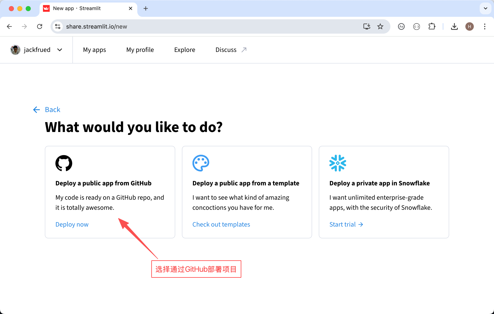

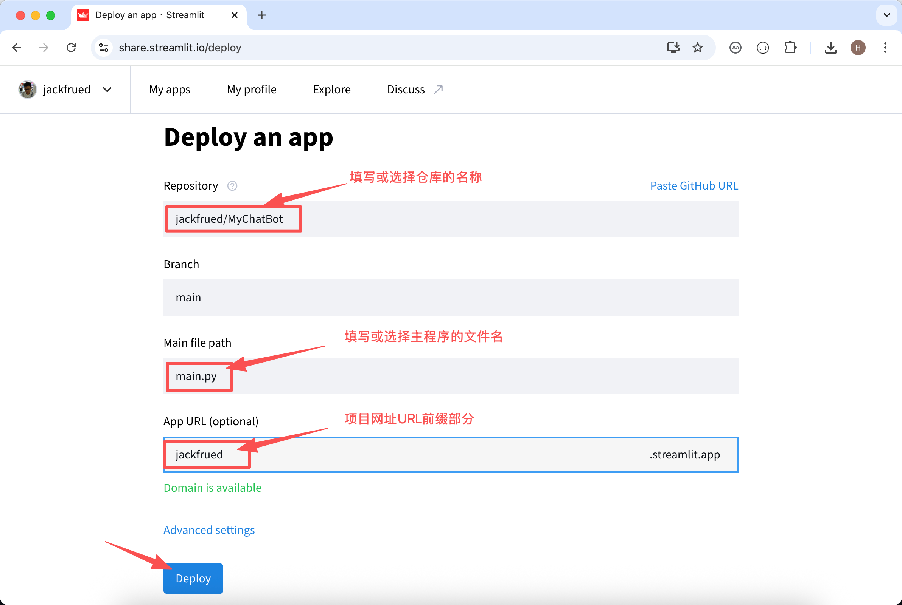

> **说明**：上图所示的画面，点击 Advanced Settings 可以打开如图所示的高级设置窗口。
>
> 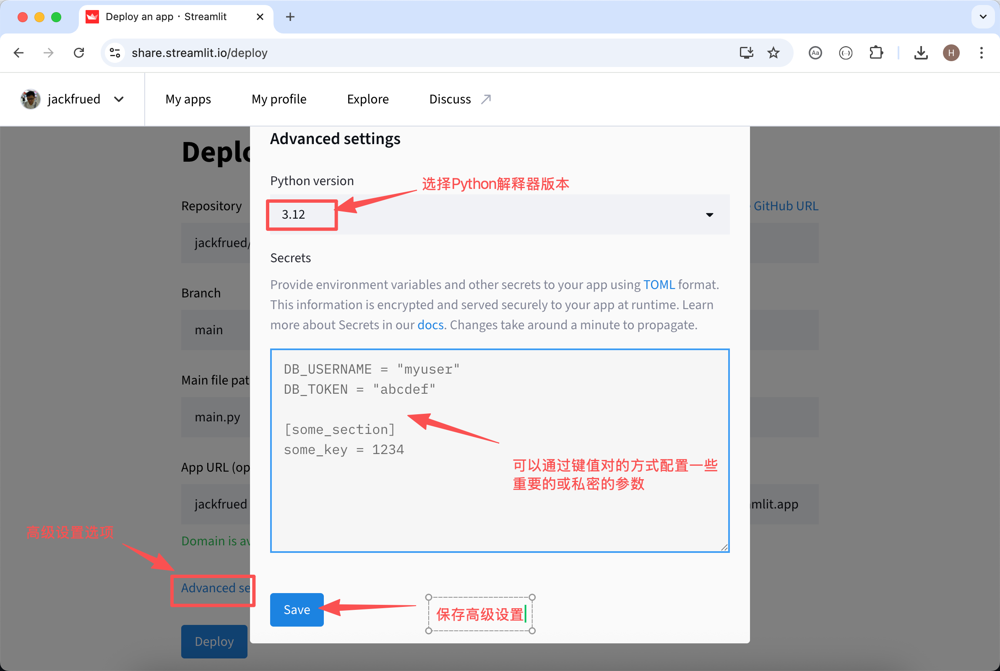

项目部署的过程中，点击窗口右下角的 Manage app，可以看到如下图所示的画面，窗口右侧相当于是项目的控制台，我们可以看到部署项目的过程中，Streamlit Cloud 会从 GitHub 仓库克隆项目，检查`requirements.txt`文件中的依赖项清单并执行安装，所有准备工作就绪之后，项目就会启动起来，运行效果我们在文章开始的时候已经为大家展示过了，大家赶紧自己动手试一试吧，有问题可以在评论区给我留言或者私信我。

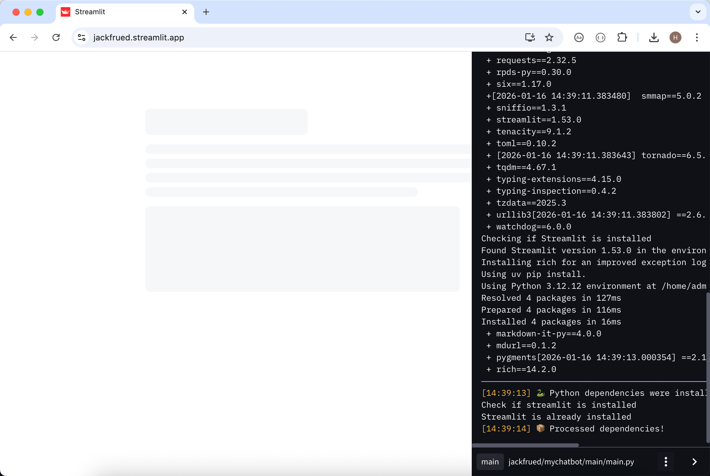

如果想从 Streamlit Cloud 上删除项目或者修改配置，可以按照如下图所示的方式操作。

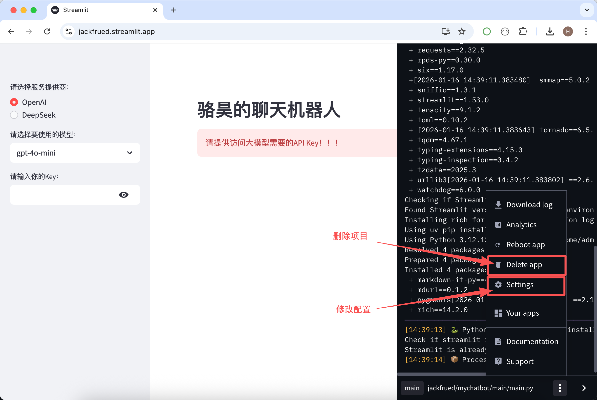

### 总结

在这一章中，我们用最朴素的方式实现了一个完整的 AI 聊天机器人应用，完成了从代码片段到完整产品的关键跨越。感到喜悦的同时，我们也建议大家重新审视一下上面的代码，相信不难发现我们的代码有一些潜在的风险，具体包括：

1. 如果要更好的控制输入输出，使用的提示词还需要调整。
2. 如果要引入更多的功能，模型调用逻辑会逐渐重复。
3. 如果要加工具、加记忆、加规划，代码会迅速膨胀臃肿。

当然，这些问题是所有 AI 应用都会遇到的阶段性瓶颈，所以稍后我们会引入 LangChain 以及其他的框架，看看如何使用更加系统的方式来构建 AI 应用。事实上，很多领域的开发任务，我们都会强调“不要重复发明轮子”（听过这句话的可以在评论区举个手）。使用框架简化开发，让开发者更加专注于核心业务，这才是软件开发的正道。